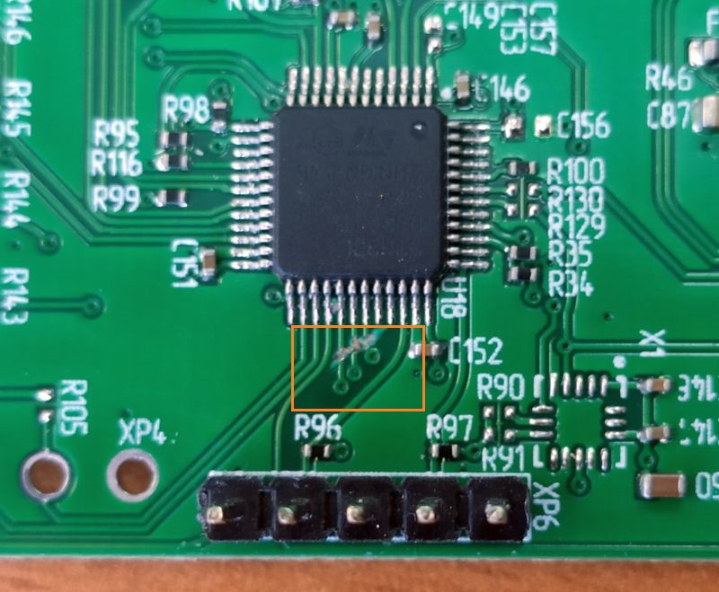
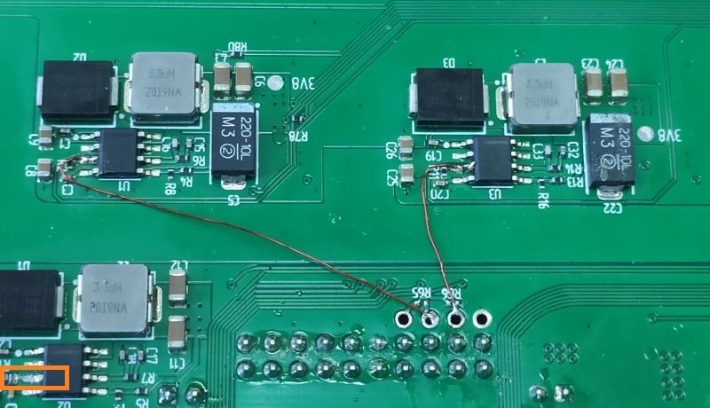

# Biforcom MCR-202 — OpenWrt 25.12.0

Готовый образ OpenWrt для роутера **Biforcom MCR-202** на базе NanoPi Core / Allwinner H3. Сборка подготовлена для работы с четырьмя Ethernet-портами и двумя LTE-модемами Quectel EC25.

## Техническое описание Biforcom MCR-20x

Полное описание производителя: [b4com.tech — MCR-20x](https://b4com.tech/?page_id=280).

### Аппаратная платформа

- NanoPi Core
- SoC: Allwinner H3, 4 × Cortex-A7, до 1,2 ГГц
- RAM: 512 МБ DDR3
- Накопитель: microSD/TF (до 32 ГБ), SPI-NOR 2 МБ
- Ethernet: встроенный порт NanoPi Core 10/100 Мбит/с (LAN0)
- три контроллера SMSC LAN9514 с USB-хабом и преобразователями USB–Ethernet 10/100 Мбит/с (LAN1–LAN3)
- до трёх LTE-модемов Quectel EC25-EU Cat.4 в исполнении LCC
- две всенаправленные антенны для каждого модема, поддержка MIMO 2×2
- USB 2.0
- контроллер supervisor/watchdog/кнопок STM32L052T8, управляющий перезапуском NanoPi Core и модемов
- отдельные DC-DC-преобразователи TPS54332, 3,3 В / 3 А для каждого модема, управляемые STM32L052T8
- основной DC-DC-преобразователь TPS54332, 5 В / 3 А, с управлением watchdog STM32L052T8
- держатель аккумулятора Li-Ion 18650 ёмкостью 2200 мА·ч, зарядное устройство и повышающий преобразователь для резервного питания
- Питание: 12 В, 4 А

## Возможности сборки v8

- OpenWrt 25.12.0
- четыре Ethernet-порта в общем LAN-мосту
- одновременное обнаружение двух LTE-модемов
- интерфейсы QMI для подключения к мобильной сети
- страница LuCI **LTE Modems** с состоянием модемов и уровнем сигнала
- управление питанием модемов при загрузке

## GPIO питания LTE-модемов

В этой сборке используются следующие линии управления питанием:

| Модем | GPIO | Назначение |
|---|---:|---|
| Modem 1 | **GPIO140** | включение питания первого EC25 |
| Modem 2 | **GPIO141** | включение питания второго EC25 |

Во время загрузки система последовательно включает Modem 1 через GPIO140 и Modem 2 через GPIO141. На отдельных версиях платы GPIO140 может быть уже занят прошивкой/Device Tree и не экспортироваться через старый интерфейс `/sys/class/gpio`; в таком случае это ожидаемое поведение, если первый модем определяется системой.

> Важно: аппаратные доработки разных ревизий MCR-202 могут отличаться. Перед подключением GPIO проверьте ревизию платы и разводку цепей питания. GPIO нельзя подключать напрямую к силовой линии модема — он должен управлять штатным DC-DC-преобразователем/входом включения.

## Аппаратная доработка для OpenWrt

На старых ревизиях MCR-202 для независимого управления питанием модемов из OpenWrt применялась следующая доработка:

1. Разрезать три дорожки/соединения возле STM32 (выводы 29, 30 и 31), отмеченные рамкой на фотографии.

   

2. Подключить две перемычки от GPIO к выводу №3 преобразователей U1 и U3, как показано на фотографии. Для нашей сборки используются GPIO140 и GPIO141.

   

3. Разрезать соединение либо установить подтяжку на выводе №3 U2 — конкретный вариант зависит от ревизии платы и установленного третьего модема.

> **Внимание:** это аппаратное вмешательство с риском необратимого повреждения платы. Перед пайкой обязательно отключите питание и аккумулятор, прозвоните цепи и сопоставьте обозначения элементов со своей ревизией платы. Фотографии служат ориентиром и не заменяют электрическую схему.

## Образ прошивки

Файл:

```text
openwrt-25.12.0-nanopi-neo-mcr202-v8-dualmodem-4lan-squashfs-sdcard.img.gz
```

Размер архива: `9 207 541` байт.

SHA-256:

```text
F131464B998ED37EDCEC76B7D3371EC44A0083774D6FD6C7F0C64028C14B712C
```

## Установка

1. Проверьте SHA-256 скачанного файла.
2. Распакуйте файл `.img.gz`.
3. Запишите полученный `.img` на microSD с помощью Rufus, balenaEtcher или `dd`.
4. Установите карту в MCR-202 и включите питание.
5. После загрузки проверьте наличие `eth0`–`eth3`, `/dev/cdc-wdm0` и `/dev/cdc-wdm1`.

Пример проверки:

```sh
ip link
ls -l /dev/cdc-wdm* 2>/dev/null
ls -d /sys/class/net/wwan* 2>/dev/null
logread | grep -Ei 'mcr202|qmi|cdc-wdm|wwan|gpio'
```

## Исходное аппаратное описание

Проект основан на сведениях о семействе Biforcom MCR-10x/MCR-20x из старого репозитория [Harwesta/Biforcom-MCR-routers](https://github.com/Harwesta/Biforcom-MCR-routers), дополненных результатами настройки и проверки данной сборки на MCR-202.
